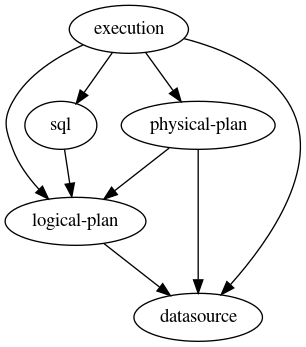

# Documentation

See the companion book [How Query Engines Work](https://leanpub.com/how-query-engines-work/) for design documentation. `kotlin-query` is the reference implementation of the design discussed in this book.

## Dependency Diagram



This diagram was provided by GraphViz. 

```bash
sudo apt install graphviz
dot -Tpng dependencies.dot -odependencies.png
```